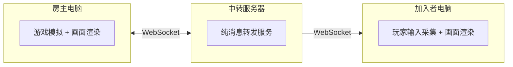

# 张雪峰大战科比
> 某大学一年级通识课期末大作业

> 一款基于 HTML5 Canvas 的 2D 俯视角局域网双人对战射击游戏。

---

## 项目简介

这是一款纯前端实现的 2D 俯视角射击游戏，支持局域网内两台设备实时对战。无需任何游戏引擎或第三方框架，仅使用原生 JavaScript + Canvas 2D + WebSocket 构建。

**核心特色：**
- 局域网实时双人对战（Host-Joiner 架构）
- 战争迷雾系统（射线投射视线遮挡）
- 枪械过热机制（按子弹计温，射击升温，时间降温）
- 角色与语音（张雪峰 / 科比·布莱恩特 钜献）
- 巧乐兹/篮球 投出！！有加速/狂暴buff
- 翻滚闪避（你打不到我你信不信）

---

## 快速开始

详细的安装与运行步骤请参阅 **[SETUP.md](SETUP.md)**，内含 Mac 和 Windows 双平台的图文指南。

简要流程：
1. 安装 [Node.js](https://nodejs.org/)
2. 进入 `server/` 目录，运行 `npm install`
3. 启动服务器：`node server.js`
4. 浏览器打开 `http://localhost:3000`

> **注意：** 校园网疑似禁用了设备间联机，校内联机请使用手机热点等方式。

---

## 基本操作

| 操作     | 按键           |
| -------- | -------------- |
| 移动     | WASD 或 方向键 |
| 瞄准     | 鼠标移动       |
| 射击     | 鼠标左键       |
| 扔手雷   | G 键           |
| 翻滚闪避 | 空格键         |

---

## 玩法规则

- **对战模式**：两位玩家在有掩体的竞技场中对战
- **子弹**：直线飞行，被墙壁阻挡，每颗造成 12 点伤害
- **手雷**：可飞过墙壁，落地后爆炸造成 40 点范围伤害
- **翻滚**：翻滚期间有无敌帧（约 0.4 秒），但翻滚后有 3 秒冷却
- **重生**：被击败后 3 秒自动重生
- **生命值**：满血 100
- **枪械过热**：连续射击会升温，达到上限后过热无法射击，需等待降温恢复
- **角色技能**：
  - **张雪峰**（Host）：扔手雷后 5 秒内移动速度 x1.5
  - **科比**（Joiner）：扔手雷后 5 秒内枪械不积累热量

---

## 技术架构



- **服务器**：纯 WebSocket 中继，不做任何游戏计算
- **房主**：运行完整游戏模拟（物理、碰撞、伤害判定），约 30 次/秒发送状态快照
- **加入者**：仅发送输入、接收状态并渲染画面

---

## 项目结构

```
项目根目录/
  index.html          游戏入口页面（大厅 + 启动逻辑）
  README.md           本文件（项目总览）
  SETUP.md            安装与运行指南
  ATTRIBUTIONS.md     声明与致谢
  css/
    style.css         大厅界面样式
  js/
    utils.js          数学工具函数
    input.js          键盘和鼠标输入管理
    assets.js         资源预加载（图片 + 音频）
    map.js            地图定义与碰撞检测
    player.js         玩家角色（移动、翻滚、瞄准、过热）
    bullet.js         子弹逻辑
    grenade.js        手雷逻辑（抛物线 + 爆炸）
    vision.js         战争迷雾（射线投射）
    network.js        WebSocket 网络通信
    hostGame.js       房主游戏循环（模拟 + 渲染）
    clientGame.js     加入者游戏循环（仅渲染）
  server/
    server.js         WebSocket 中继服务器
    package.json      Node.js 项目配置
  assets/
    characters/       角色图片素材
    grenades/         手雷图片素材
    voices/           角色语音文件
```

---

## 声明与致谢

本项目使用的角色肖像、品牌素材及 AI 辅助开发等详细声明，请参阅 **[ATTRIBUTIONS.md](ATTRIBUTIONS.md)**。
